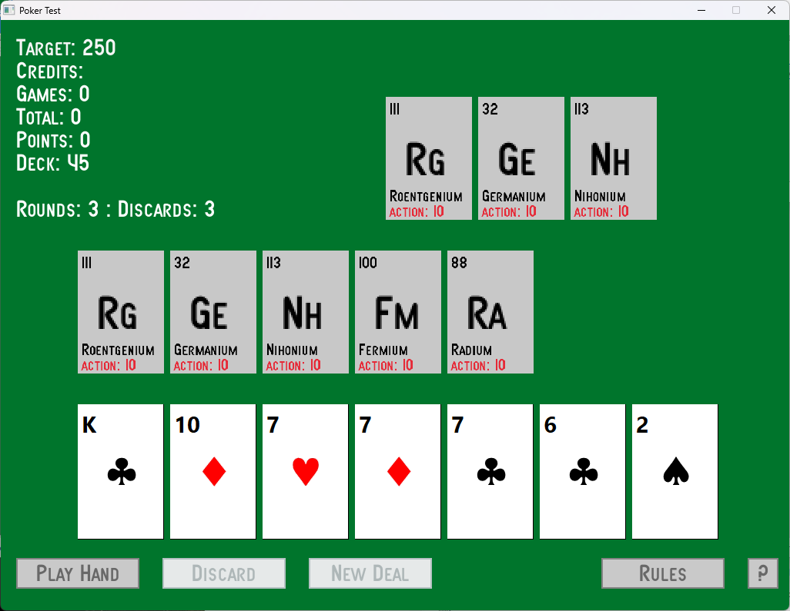

# Poker Test

After playing Balatro I wanted to see if I could create a poker game. I used Free Pascal and Raylib to create something basic. I used my Playing Card Generator to make the pack.

## Why Free Pascal?

I use C# and C++ at work; they come with a bunch of issues to do with cross platform work - in this case Windows and Linux.

Free Pascal has very few of these issues. The compiler generates native 64 bit code for both platforms, and the UI library (not used) is compatible with Windows, Linux, Mac and other platforms.

Free Pascal uses its own make system, so doesn't need one per platform.

## Raylib?

Raylib is a nice 2D games engine that's an API. Godot is another choice but forces you to use scenes.

## Why?

Because I like to try out stuff like this. It's fun! Writing the rules for poker was the easiest part - the biggest part is yet to come, the quirky power ups that Balatro uses (which I won't copy but will be inspired by) and the animations and audio, which I haven't even thought about yet.

# It's all open source

I'm not trying to sell this as a product, I'm just writing something for the sake of writing it.

Welcome Screen

Game Screen

Rules Screen

Copyright (c) 2024 Pete Goodwin