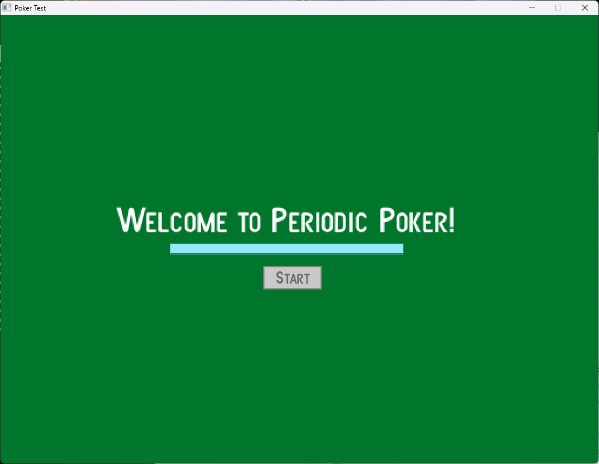
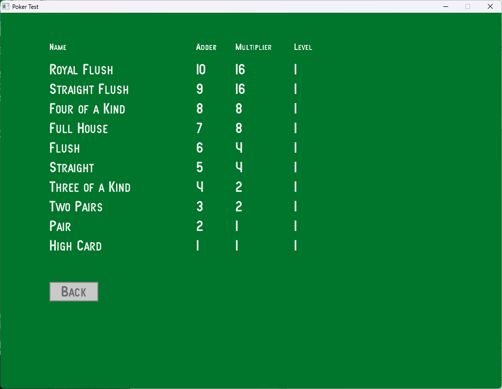

# Poker Test

After playing Balatro I wanted to see if I could create a poker game. I used Free Pascal and Raylib to create something basic. I used my Playing Card Generator to make the pack.

Welcome Screen

Game Screen

Rules Screen

Copyright (c) 2024 Pete Goodwin